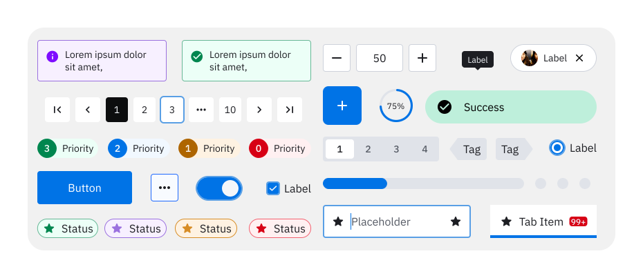

# Zeta Flutter monorepo

<picture style="max-width: 400px">
  <source media="(prefers-color-scheme: dark)" srcset="./packages/zeta_flutter/example/dark-wide.svg">
  <source media="(prefers-color-scheme: light)" srcset="./packages/zeta_flutter/example/light-wide.svg">
  
</picture>

Zeta is the new, formal, standardized Zebra Design System based off the successes of ZDS (Zebra Design System). This monorepo contains the source code for all Zeta Flutter packages.

> 🚧 Looking for the Zeta Flutter components? [Click here!](https://github.com/ZebraDevs/zeta_flutter/tree/main/packages/zeta_flutter)

## Packages

| Code                                                                                                   | Link                                                   |
| ------------------------------------------------------------------------------------------------------ | ------------------------------------------------------ |
| [zeta_flutter (components)](https://github.com/ZebraDevs/zeta_flutter/tree/main/packages/zeta_flutter) | [pub.dev](https://pub.dev/packages/zeta_flutter)       |
| [zeta_flutter_theme](https://github.com/ZebraDevs/zeta_flutter/tree/main/packages/zeta_flutter_theme)  | [pub.dev](https://pub.dev/packages/zeta_flutter_theme) |
| [zeta_flutter_utils](https://github.com/ZebraDevs/zeta_flutter/tree/main/packages/zeta_flutter_utils)  | [pub.dev](https://pub.dev/packages/zeta_flutter_utils) |
| [zeta_flutter_icons](https://github.com/ZebraDevs/zeta_flutter/tree/main/packages/zeta_icons)          | [pub.dev](https://pub.dev/packages/zeta_icons)         |

## Contributing

We welcome contributions in this repo; please see our contribution guidelines (see [CONTRIBUTING](./CONTRIBUTING.md) or [design.zebra.com](https://design.zebra.com/docs/Development/contributing))

## Licensing

This software is licensed with the MIT license (see [LICENSE](./LICENSE) and [THIRD PARTY LICENSES](./LICENSE-3RD-PARTY)).

---
